```R
# -------------------------base----------------------------
```


```R
options(repr.plot.width=10, repr.plot.height=5, repr.plot.pointsize=8,warn = -1)
df <- read.csv("./data/Facet_Data.csv")
```


```R
head(df)
```


<table>
<thead><tr><th scope=col>age</th><th scope=col>tau</th><th scope=col>Class</th><th scope=col>SOD</th><th scope=col>male</th></tr></thead>
<tbody>
	<tr><td>0.9876238</td><td>6.297754 </td><td>Control  </td><td>5.609472 </td><td>0        </td></tr>
	<tr><td>0.9866667</td><td>6.270988 </td><td>Control  </td><td>5.723585 </td><td>1        </td></tr>
	<tr><td>0.9867021</td><td>6.152733 </td><td>Control  </td><td>5.771441 </td><td>0        </td></tr>
	<tr><td>0.9871630</td><td>6.623707 </td><td>Control  </td><td>5.655992 </td><td>0        </td></tr>
	<tr><td>0.9854651</td><td>5.740789 </td><td>Control  </td><td>5.509388 </td><td>1        </td></tr>
	<tr><td>0.9862637</td><td>4.871603 </td><td>Control  </td><td>4.532599 </td><td>1        </td></tr>
</tbody>
</table>


```R
plot(df$SOD,df$tau)
```


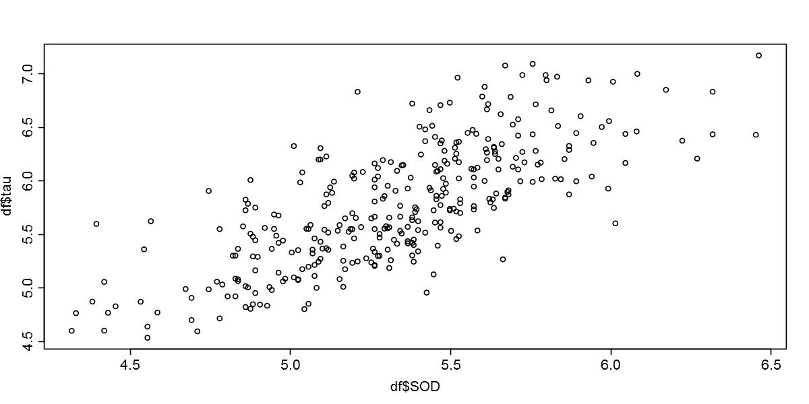


```R
hist(df$SOD,breaks = 30,ylim = c(0,40),main = "")
```


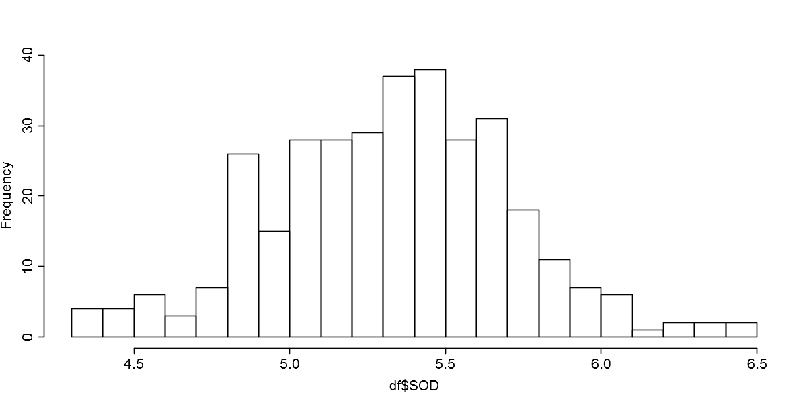


```R
boxplot(df$SOD~df$Class,xlab="Class",ylab="SOD")
```


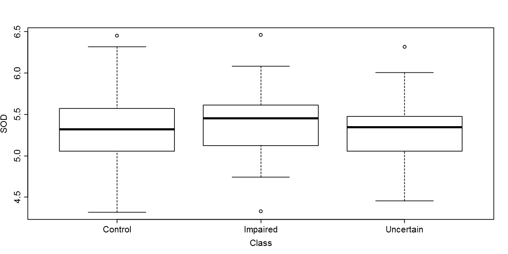


```R
#----------------------------lattice---------------------------
```


```R
library(lattice)
```


```R
p1 <-lattice::xyplot(SOD~tau,data = df,col = "black")
p1
```


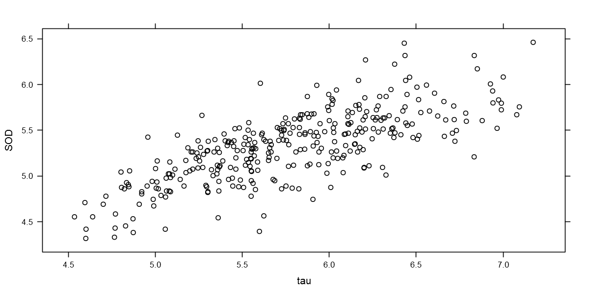


```R
p2 <-lattice::histogram(x = ~SOD,data = df,breaks = 30,type = "count",nint = 30,col="white")
p2
```


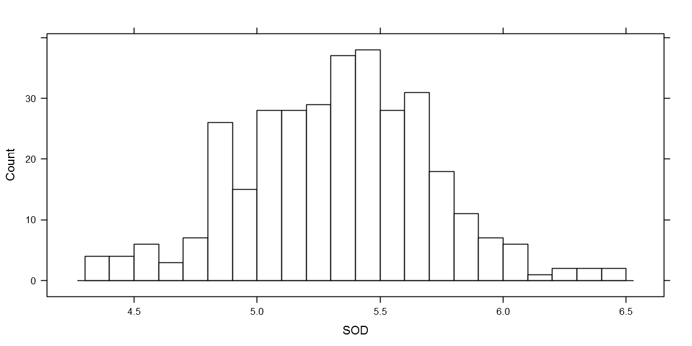


```R
p3 <-lattice::bwplot(x = SOD~Class,data = df)
p3
```


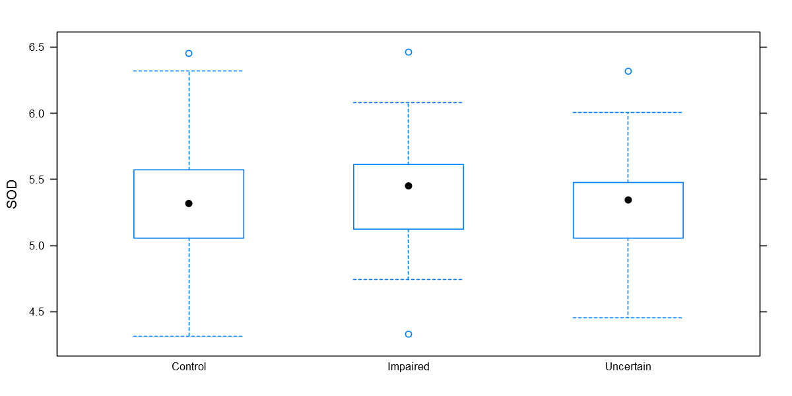


```R
p4 <-lattice::bwplot(x = Class~SOD,data = df)
p4
```


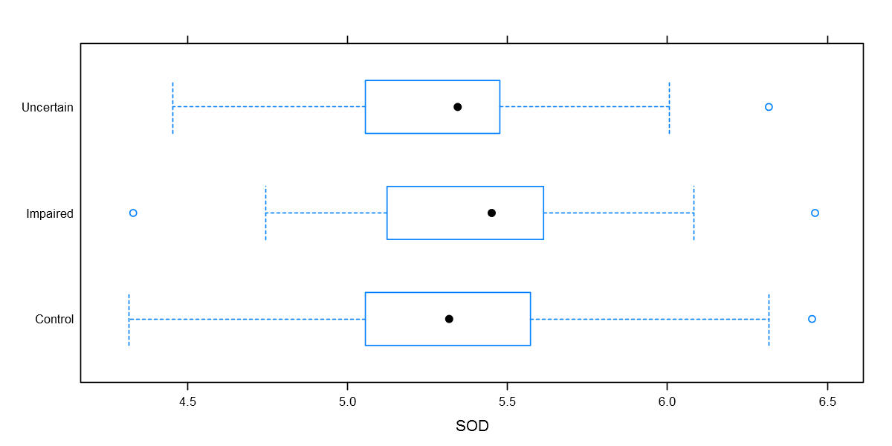


```R
library(gridExtra)
```


```R
grid.arrange(p1,p2,p3,p4,ncol=2)
```


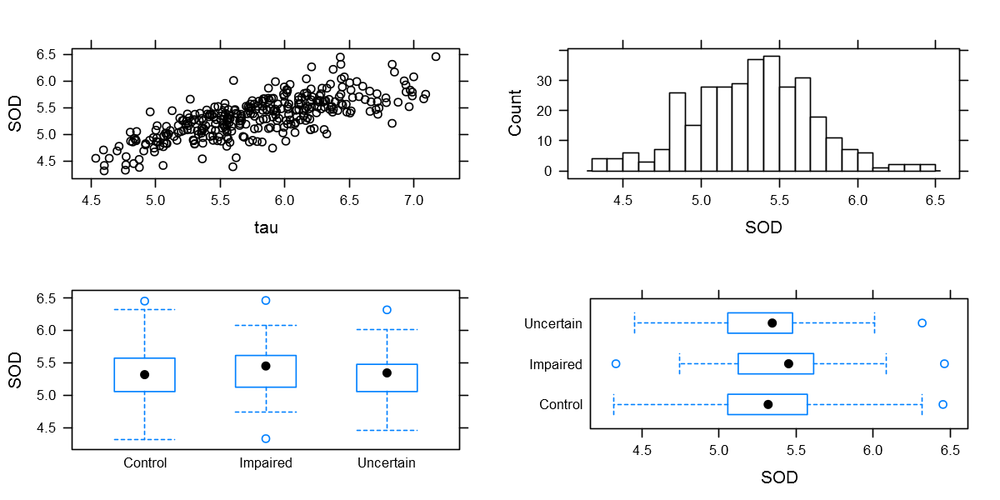


```R
#-------------------------ggplot2----------------------------
```


```R
library(ggplot2)
```


```R
p1<-ggplot(data = df,mapping = aes(x = SOD,y = tau))+
    geom_point()#shape=21,color="black",fill="red",size=3,stroke=0.1
p1
```


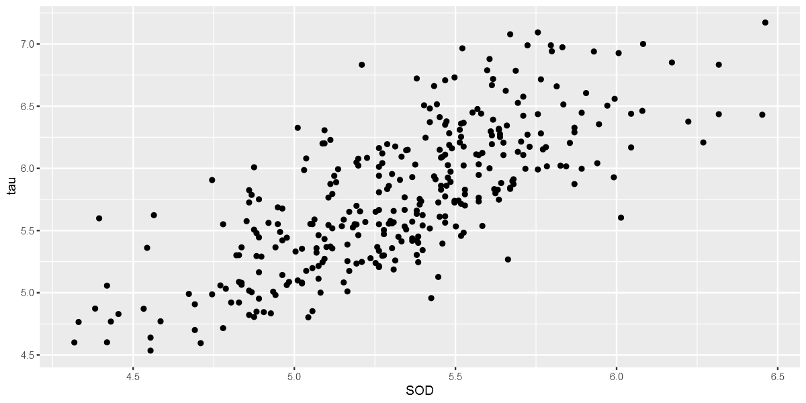


```R
p2<-ggplot(data = df,mapping = aes(x = SOD))+
    geom_histogram(bins = 30,color="black",fill="white")
p2
```


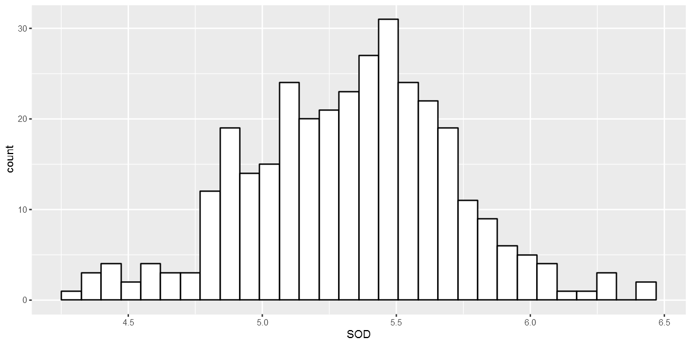


```R
p3<-ggplot(data = df,mapping = aes(x = Class,y = SOD))+
    geom_boxplot()
p3
```


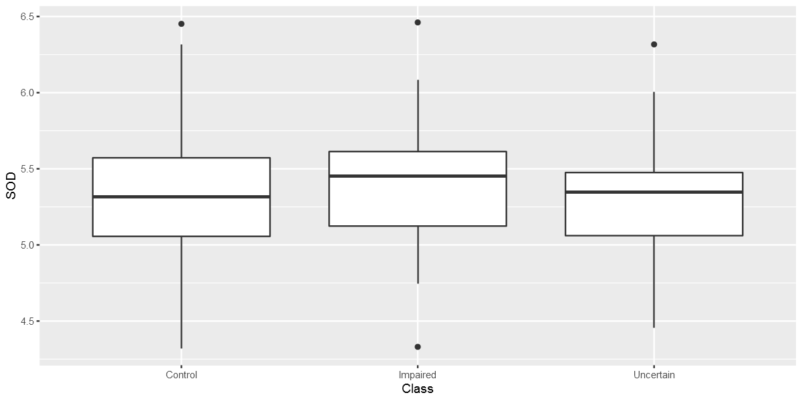


```R
grid.arrange(p1,p2,p3,nrow=1)
```


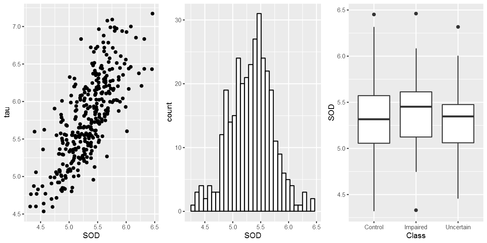

